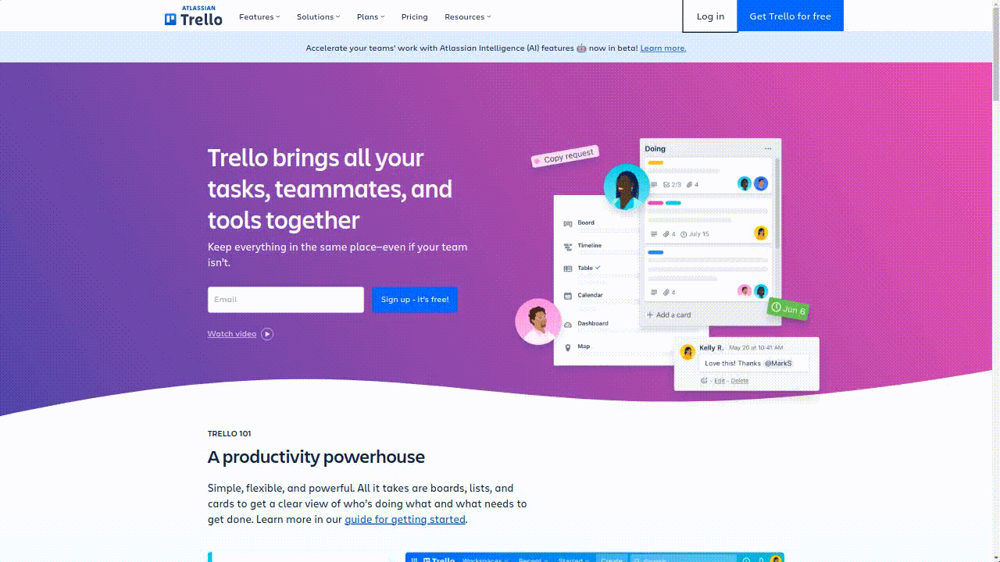

#  Cypress - Trello E2E tests 

<p align="center">

</p>

## Installation

Clone the repository

```
git clone https://github.com/acelmer/cypress-trello.git
```

Install project dependencies

```
npm install
```

Open Cypress Launchpad

```
npx cypress open
```

## Environment Variables

Create a **cypress.env.json** file and add your own variable values

```
{
    "TRELLO_USERNAME":  "your email",
    "TRELLO_PASSWORD":  "your password",
    "TRELLO_API_KEY":   "your API key",
    "TRELLO_API_TOKEN": "your API token"
}
```
In order to get your API key and token visit: https://developer.atlassian.com/cloud/trello/guides/rest-api/api-introduction/